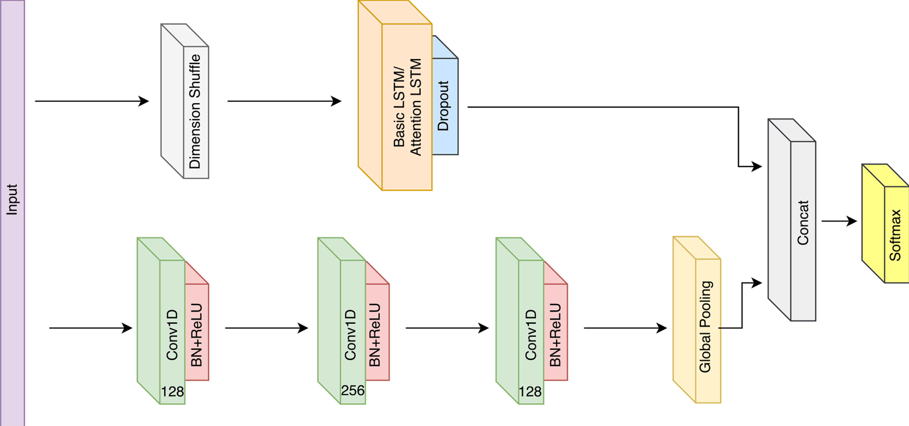

## 模型

## CNN
1.Baseline  `0.711左右的分数`

https://mp.weixin.qq.com/s/r7Ai8FVSPRB71PVghYk75A
更换优化算法 `0.7296349206349205`
```text
model.compile(loss='categorical_crossentropy',
                  optimizer='rmsprop',
                  metrics=['acc'])
```
`线上0.7296349206349205`

2. 开源Baseline ot_code代码 `线上0.74`

```text
23/23 [==============================] - 1s 43ms/step - loss: 0.1183 - acc: 0.9578 - val_loss: 1.1392 - val_acc: 0.7455 - lr: 7.8125e-06
Epoch 178/500
23/23 [==============================] - 1s 43ms/step - loss: 0.1159 - acc: 0.9597 - val_loss: 1.1376 - val_acc: 0.7476 - lr: 7.8125e-06
Epoch 00178: early stopping

```
线上0.7456984126984126

将优化算法调整为rmsprop线上`分数0.7463015873015874`
```text
Epoch 161/500
23/23 [==============================] - 1s 44ms/step - loss: 0.1667 - acc: 0.9412 - val_loss: 0.9308 - val_acc: 0.7510 - lr: 7.8125e-06
Epoch 162/500
23/23 [==============================] - 1s 44ms/step - loss: 0.1751 - acc: 0.9403 - val_loss: 0.9285 - val_acc: 0.7510 - lr: 7.8125e-06
Epoch 00162: early stopping
```
从上面可以看出来rmsprop要优于Adam算法
3. bp_cnn
在卷积层之后添加批归一化
```text
X = Conv2D(filters=128,
               kernel_size=(3, 3),
               activation='relu',
               padding='same')(X)
    X = BatchNormalization()(X)
```
训练效果有明显提升
```text
Epoch 153/500
23/23 - 1s - loss: 0.0745 - acc: 0.9794 - val_loss: 0.8036 - val_acc: 0.7716 - lr: 7.8125e-06
Epoch 154/500
23/23 - 1s - loss: 0.0777 - acc: 0.9775 - val_loss: 0.8064 - val_acc: 0.7709 - lr: 7.8125e-06
Epoch 00154: early stopping

```
`线上 0.7661587301587302`

删除两个特征之后，`线上0.7644`

4. 尝试不同的归一化方式
- Group Normalization (TensorFlow Addons)
```text
23/23 - 2s - loss: 0.0185 - acc: 0.9971 - val_loss: 0.8559 - val_acc: 0.8073 - lr: 1.5625e-05
Epoch 157/500
23/23 - 2s - loss: 0.0173 - acc: 0.9971 - val_loss: 0.8587 - val_acc: 0.8107 - lr: 7.8125e-06
Epoch 158/500
23/23 - 2s - loss: 0.0186 - acc: 0.9964 - val_loss: 0.8590 - val_acc: 0.8073 - lr: 7.8125e-06
Epoch 00158: early stopping
```
`线上分数0.764825396825397`

- Instance Normalization (TensorFlow Addons)
```text
23/23 - 2s - loss: 2.8817 - acc: 0.1030 - val_loss: 2.8588 - val_acc: 0.1021 - lr: 0.0010
Epoch 2/500
23/23 - 2s - loss: 2.8613 - acc: 0.0945 - val_loss: 2.8557 - val_acc: 0.1021 - lr: 0.0010
Epoch 3/500
23/23 - 2s - loss: 2.8608 - acc: 0.0965 - val_loss: 2.8554 - val_acc: 0.1021 - lr: 0.0010
Epoch 4/500
23/23 - 2s - loss: 2.8594 - acc: 0.0989 - val_loss: 2.8557 - val_acc: 0.1008 - lr: 0.0010
```
没有成功
- Layer Normalization (TensorFlow Core)
```text
Epoch 00112: ReduceLROnPlateau reducing learning rate to 6.25000029685907e-05.
23/23 - 2s - loss: 0.0067 - acc: 0.9995 - val_loss: 0.9610 - val_acc: 0.7970 - lr: 1.2500e-04
Epoch 113/500
23/23 - 2s - loss: 0.0052 - acc: 0.9998 - val_loss: 0.9456 - val_acc: 0.8038 - lr: 6.2500e-05
Epoch 114/500
23/23 - 2s - loss: 0.0045 - acc: 0.9995 - val_loss: 0.9422 - val_acc: 0.8018 - lr: 6.2500e-05
Epoch 00114: early stopping

```
`线上分数0.7607777777777778`

5. GlobalAveragePooling2D vs GlobalMaxPooling2D
```text
Epoch 179/500
23/23 - 1s - loss: 0.0718 - acc: 0.9762 - val_loss: 0.8834 - val_acc: 0.7936 - lr: 1.9531e-06
Epoch 00179: early stopping
accuracy_score 0.7949245541838135 acc_combo 0.8232738911751242
5kflod mean acc score:0.7934734597517326
5kflod mean combo score:0.8238260577813273
```
`GlobalAveragePooling2D 线上分数0.7686349206349207`优于 GlobalMaxPooling2D

## LSTM
1. 双向的LSTM
```text
23/23 - 1s - loss: 0.1118 - acc: 0.9609 - val_loss: 1.7949 - val_acc: 0.6543 - lr: 1.2500e-04
Epoch 00104: early stopping
accuracy_score 0.6694101508916324 acc_combo 0.7127833300672791
5kflod mean acc score:0.6626436732978505
5kflod mean combo score:0.7082775474080174
```

`线上分数0.7023650793650793`
2. [LSTM-FCN](https://github.com/titu1994/LSTM-FCN)

论文地址：[LSTM Fully Convolutional Networks for Time Series Classification](https://ieeexplore.ieee.org/document/8141873/)

- [x] 参数1
```text
def LSTM_FCN():
    input = Input(shape=(seq_len, fea_size), name="input_layer")
    x = LSTM(64)(input)
    x = Dropout(0.8)(x)

    # y = Permute((2, 1))(input)
    y = Conv1D(128, 8, padding='same', kernel_initializer='he_uniform')(input)
    y = BatchNormalization()(y)
    y = Activation('relu')(y)

    y = Conv1D(256, 5, padding='same', kernel_initializer='he_uniform')(y)
    y = BatchNormalization()(y)
    y = Activation('relu')(y)

    y = Conv1D(128, 3, padding='same', kernel_initializer='he_uniform')(y)
    y = BatchNormalization()(y)
    y = Activation('relu')(y)

    y = GlobalAveragePooling1D()(y)

    x = concatenate([x, y])

    pred = Dense(19, activation='softmax')(x)
    model = Model([input], pred)
    return model
结果
accuracy_score 0.7887517146776406 acc_combo 0.8202038016852817
5kflod mean acc score:0.7870284342677916
5kflod mean combo score:0.818158419984462
```
- [x] 参数2
```text
def LSTM_FCN():
    input = Input(shape=(seq_len, fea_size), name="input_layer")
    x = LSTM(64)(input)
    x = Dropout(0.8)(x)

    # y = Permute((2, 1))(input)
    y = Conv1D(128, 5, padding='same', kernel_initializer='he_uniform')(input)
    y = BatchNormalization()(y)
    y = Activation('relu')(y)

    y = Conv1D(256, 4, padding='same', kernel_initializer='he_uniform')(y)
    y = BatchNormalization()(y)
    y = Activation('relu')(y)

    y = Conv1D(128, 3, padding='same', kernel_initializer='he_uniform')(y)
    y = BatchNormalization()(y)
    y = Activation('relu')(y)

    y = GlobalAveragePooling1D()(y)

    x = concatenate([x, y])

    pred = Dense(19, activation='softmax')(x)
    model = Model([input], pred)
    return model
```
线下：
lstm_acc 0.7962136532999378
combo 0.8261682540488406
- 线上0.754 代码对应为[lstm.py](lstm.py)
- 加入class weight引起过拟合

3. [MLSTM-FCN](https://github.com/titu1994/MLSTM-FCN)
代码：[mlstm_fcn.py](mlstm_fcn.py)
- 原始`generate_model`
```text
accuracy_score 0.7764060356652949 acc_combo 0.8090012411000044
acc_scores: [0.8163125428375599, 0.7930089102124743, 0.7908093278463649, 0.789437585733882, 0.7764060356652949]
combo_scores: [0.842749436992068, 0.8260060706942118, 0.822294075380494, 0.8216735253772278, 0.8090012411000044]
5kflod mean acc score:0.7931948804591152
5kflod mean combo score:0.8243448699088012
```
线上：0.761

- 输入train_lstm,train_lstm_inv,train_features
```text
accuracy_score 0.8168724279835391 acc_combo 0.8431314912796375
acc_scores: [0.8122001370801919, 0.818368745716244, 0.8237311385459534, 0.821673525377229, 0.8168724279835391]
combo_scores: [0.8394203466170552, 0.8462090799308052, 0.8495656149977121, 0.8504474492128801, 0.8431314912796375]
5kflod mean acc score:0.8185691949406314
5kflod mean combo score:0.8457547964076181
```
线上0.776

4. [EMN](https://github.com/qianlima-lab/EMN)
Time series classification with Echo Memory Networks

## Multi Input
cnn双输入（正向sequences和反向sequences） 可以对应har.py代码，
线上0.7726190476190478
线下har_acc0.8123967315118028_combo0.8401833538228309.csv


## HAR：CNN输入与Dense输入融合
优化的地方：

- 目前尝试输入时间序列数据与特征数据，特征不能漫蛮力添加
- CNN中间BN和Dropout稍微有调整，减少一些BN
- 调整数据补齐：将frame的前20条数据进行填充
- 5个随机种子 5折：0.788063492063492 模型较稳定
- ★根据类别频率统计class weight，加上线上效果0.788666
- 使用jitter进行数据增强：线下分数较高，线上0.779
- 加入LSTM-FCN之后，0.781
## 失败的尝试
- 添加特征
- lstm：也不算失败，目前网络结构比较简单，个人感觉应该LSTM的效果比CNN要好
- 超参数调优
- 加上归一化之后 效果比较差

```text
print('Scaler....')
for col in ['acc_x','acc_y','acc_z','acc_xg','acc_yg','acc_zg','mod','modg']:
    scaler = MinMaxScaler().fit(data[[col]])
    train[[col]] = scaler.transform(train[[col]])
```

- 加入特征
```text
角度特征

# 角度
# data['acc_x_cos(x)'] = data['acc_x'] / data['mod']
# data['acc_y_cos(y)'] = data['acc_y'] / data['mod']
# data['acc_z_cos(z)'] = data['acc_z'] / data['mod']
# data['acc_x_angle(x)'] = np.arccos(data['acc_x_cos(x)'])
# data['acc_y_angle(y)'] = np.arccos(data['acc_y_cos(y)'])
# data['acc_z_angle(z)'] = np.arccos(data['acc_z_cos(z)'])
```

```text
# 2020.7.8
data['mod2'] = data.acc_x ** 2 + data.acc_y ** 2 + data.acc_z ** 2
data['modg2'] = data.acc_xg ** 2 + data.acc_yg ** 2 + data.acc_zg ** 2

92/92 - 2s - loss: 0.0624 - acc: 0.9803 - val_loss: 0.8870 - val_acc: 0.7840 - lr: 3.1250e-05
Epoch 00117: early stopping
accuracy_score 0.7839506172839507 acc_combo 0.8136063753347688
```
`线上0.7614603174603174`

- 数据增强
```text
datagen = tf.keras.preprocessing.image.ImageDataGenerator(
    height_shift_range=0.1,  # randomly shift images vertically (fraction of total height)
    horizontal_flip=True,  # randomly flip images
    vertical_flip=True  # randomly flip imag
)

```
`线下0.792` `线上0.7577619047619049`

- LSTM+CNN
```text
92/92 - 2s - loss: 0.0656 - acc: 0.9798 - val_loss: 1.0423 - val_acc: 0.7599 - lr: 7.8125e-06
Epoch 138/500
92/92 - 2s - loss: 0.0594 - acc: 0.9832 - val_loss: 1.0431 - val_acc: 0.7613 - lr: 7.8125e-06
Epoch 00138: early stopping
accuracy_score 0.766803840877915 acc_combo 0.800509504213206
```
`线上0.758`

- X = GlobalMaxPooling2D()(X)
```text
Epoch 119/500
23/23 - 1s - loss: 0.1941 - acc: 0.9311 - val_loss: 0.9021 - val_acc: 0.7359 - lr: 6.2500e-05
Epoch 00119: early stopping
accuracy_score 0.7414266117969822 acc_combo 0.7816317199033243
5kflod mean acc score:0.728880483560249
5kflod mean combo score:0.7694991110919478
```
`线上 0.7402857142857142`


- VGG19 预训练模型 
```text
accuracy_score 0.10150891632373114 acc_combo 0.1966490299823643
5kflod mean acc score:0.35815603637043997
5kflod mean combo score:0.4347271162644451
```

- 加入word2vec词向量特征

```text
feainput = Input(shape=(w2v_fea))
    dense = Dense(32, activation='relu')(feainput)
    dense = BatchNormalization()(dense)
    dense = Dropout(0.2)(dense)
    dense = Dense(64, activation='relu')(dense)
    dense = Dropout(0.2)(dense)
    dense = Dense(128, activation='relu')(dense)
    dense = Dropout(0.2)(dense)
    dense = Dense(256, activation='relu')(dense)
    dense = BatchNormalization()(dense)

```

- Disout
和Dropout类似，线下效果相比dropout差，线上0.787，另外收敛时间比较慢
## 参考资料
- [HAR](https://github.com/search?q=HAR+cnn)
- [HAR-WISDM_ar](https://github.com/coloriz/HAR-WISDM_ar)
- [Human Activity Recognition (HAR) Tutorial with Keras and Core ML](https://towardsdatascience.com/human-activity-recognition-har-tutorial-with-keras-and-core-ml-part-1-8c05e365dfa0)
- [ecg-classification](https://github.com/hedrox/ecg-classification/blob/master/tensorflow_impl/cnn_tf2.py)